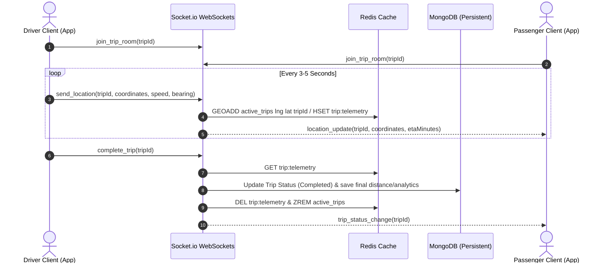
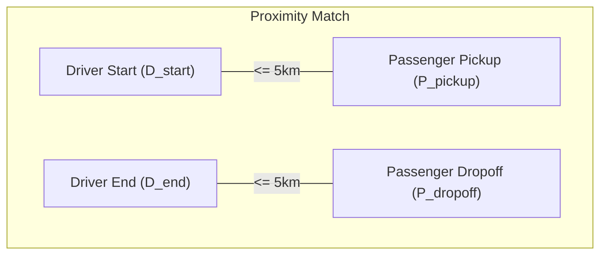

# Enterprise Carpooling Platform - Architecture Recommendation

This document outlines the recommended architecture, technology stack, database schemas, and implementation strategy for building the **Enterprise Carpooling Platform** using the **MERN (MongoDB, Express.js, React.js, Node.js)** stack.

## Final Stack Decisions

These choices are locked for the team MVP so frontend, backend, and database work stays compatible.

*   **Frontend state**: React Query for server state and small React context/local state for UI/session glue.
*   **Styling**: Tailwind CSS + Shadcn UI.
*   **Maps**: Google Maps Platform for autocomplete, route preview, distance, and live map rendering.
*   **Auth**: JWT returned by login and sent as `Authorization: Bearer <JWT_TOKEN>` on protected REST calls.
*   **Scheduler**: Node-Cron for the MVP.
*   **Payments**: Razorpay Test Mode for wallet recharge; ride fare payment records `Wallet`, `Cash`, `UPI`, or `Card`.
*   **Coordinate format**: All coordinate arrays are `[lng, lat]`.

---

## 1. High-Level Architecture Overview

The system utilizes a distributed, real-time architecture to handle high-frequency location updates, instant messaging, and transactional payments.

```mermaid
graph TD
    %% Clients
    subgraph Clients ["Client Layer"]
        EmployeeApp["React Web App (Employee View)"]
        AdminApp["React Web App (Admin View)"]
    end

    %% Backend Services
    subgraph ServerLayer ["Backend Service Layer"]
        ExpressApp["Express.js REST API & WebSocket Server"]
    end

    %% Cache & DB
    subgraph DatabaseLayer ["Data & Caching Layer"]
        MongoDB[("MongoDB Primary Database")]
        Redis[("Redis Memory Store")]
    end

    %% External Services
    subgraph ExternalServices ["External APIs"]
        GoogleMaps["Google Maps Platform API"]
        Razorpay["Razorpay (Payment Sandbox)"]
    end

    %% Connections
    EmployeeApp -->|HTTPS / REST| ExpressApp
    AdminApp -->|HTTPS / REST| ExpressApp
    EmployeeApp <-->|WSS (WebSockets)| ExpressApp
    
    ExpressApp --> MongoDB
    ExpressApp --> Redis
    
    ExpressApp --> GoogleMaps
    ExpressApp --> Razorpay
```

---

## 2. Technology Stack Selection

### Frontend (Client Layer)
*   **Framework**: **React.js** (scaffolded via **Vite** for fast builds and hot module replacement).
*   **Routing**: **React Router DOM** for client-side routing.
*   **State Management**: **React Query** for server-state synchronization, with lightweight React context/local state for session and UI-only state.
*   **Styling**: **Tailwind CSS + Shadcn UI** to create a premium, modern dark/light mode interface.
*   **Maps & Tracking**: **Google Maps Platform** with `@react-google-maps/api` to render interactive maps, routes, and live driver markers.
*   **Real-time Client**: **Socket.io-client** to maintain persistent WebSocket connections for live tracking and chat.

### Backend (Service Layer)
*   **Runtime Environment**: **Node.js** (LTS version).
*   **Web Framework**: **Express.js** for RESTful API routing, middleware, and request validation.
*   **Real-time Gateway**: **Socket.io** integrated with the Express server for bi-directional event communication.
*   **Authentication & Security**: **JSON Web Tokens (JWT)** sent through the `Authorization: Bearer <JWT_TOKEN>` header, combined with **bcryptjs** for secure password hashing.
*   **Job Scheduler**: **Node-Cron** to handle recurring rides, clean up expired ride offers, and generate daily/weekly analytical reports.

### Caching & Database Layer
*   **Primary Database**: **MongoDB** using **Mongoose** ODM. Highly flexible for document schemas like user profiles, vehicle records, ride history, and trip lifecycles.
*   **Geospatial Queries**: MongoDB's built-in **2dsphere indices** will be utilized to run distance queries (e.g., finding rides starting within a 2km radius of the passenger).
*   **In-Memory Store (Redis)**:
    *   **Live Coordinates Cache**: Storing driver location updates in Redis (`GEOADD` or hashes) to avoid overwhelming MongoDB with sub-second database write operations.
    *   **WebSocket Adapter**: Scaling WebSocket connections seamlessly if running multiple Node.js instances.

### Third-Party Services
*   **Routing & Directions**: **Google Maps Directions API** to calculate route paths, decode polyline coordinates, and determine distance/travel duration.
*   **Payment Gateway**: **Razorpay API** (configured in Test Mode/Sandbox).
*   **Voice Calling (Native OS Integration)**: HTML `tel:` protocol routing calls directly to native OS phone application. No external voice APIs required.

---

## 3. Core Database Schema Design (Mongoose)

### User Collection
Stores employee records, roles, organization associations, and home/office locations.
```javascript
const userSchema = new mongoose.Schema({
  name: { type: String, required: true },
  email: { type: String, required: true, unique: true },
  password: { type: String, required: true },
  phone: { type: String, required: true },
  department: { type: String },
  manager: { type: String },
  location: { type: String },
  role: { type: String, enum: ['Employee', 'Admin'], default: 'Employee' },
  organizationId: { type: mongoose.Schema.Types.ObjectId, ref: 'Organization', required: true },
  status: { type: String, enum: ['Pending', 'Active', 'Revoked', 'Rejected'], default: 'Pending' },
  savedPlaces: {
    home: { address: String, coordinates: { type: [Number], index: '2dsphere' } },
    office: { address: String, coordinates: { type: [Number], index: '2dsphere' } }
  },
  walletBalance: { type: Number, default: 0 }
});
```

### Vehicle Collection
Required for employees publishing rides as drivers.
```javascript
const vehicleSchema = new mongoose.Schema({
  ownerId: { type: mongoose.Schema.Types.ObjectId, ref: 'User', required: true },
  organizationId: { type: mongoose.Schema.Types.ObjectId, ref: 'Organization', required: true },
  model: { type: String, required: true }, // e.g. "Toyota Corolla"
  registrationNumber: { type: String, required: true, unique: true },
  seatingCapacity: { type: Number, required: true }, // Max seats (excluding driver)
  fuelEfficiency: { type: Number }, // km per liter (for analytics)
  status: { type: String, enum: ['Active', 'Inactive'], default: 'Active' }
});
```

### Ride Offer (Published Rides) Collection
```javascript
const rideSchema = new mongoose.Schema({
  organizationId: { type: mongoose.Schema.Types.ObjectId, ref: 'Organization', required: true },
  driverId: { type: mongoose.Schema.Types.ObjectId, ref: 'User', required: true },
  vehicleId: { type: mongoose.Schema.Types.ObjectId, ref: 'Vehicle', required: true },
  pickupLocation: {
    address: { type: String, required: true },
    coordinates: { type: [Number], index: '2dsphere' } // [long, lat]
  },
  destinationLocation: {
    address: { type: String, required: true },
    coordinates: { type: [Number], index: '2dsphere' } // [long, lat]
  },
  routePolyline: { type: String }, // Encoded route coordinates from Google Maps
  departureTime: { type: Date, required: true },
  availableSeats: { type: Number, required: true },
  farePerSeat: { type: Number, required: true },
  isRecurring: { type: Boolean, default: false },
  recurringDays: [{ type: String }], // ['Monday', 'Wednesday']
  status: { type: String, enum: ['Scheduled', 'Active', 'Completed', 'Cancelled'], default: 'Scheduled' }
});
```

### Ride Booking Collection
Represents passenger bookings for a particular ride.
```javascript
const bookingSchema = new mongoose.Schema({
  rideId: { type: mongoose.Schema.Types.ObjectId, ref: 'Ride', required: true },
  passengerId: { type: mongoose.Schema.Types.ObjectId, ref: 'User', required: true },
  seatsBooked: { type: Number, default: 1 },
  pickupPoint: {
    address: String,
    coordinates: [Number]
  },
  dropoffPoint: {
    address: String,
    coordinates: [Number]
  },
  farePaid: { type: Number },
  paymentMethod: { type: String, enum: ['Wallet', 'Cash', 'UPI', 'Card'] },
  status: { type: String, enum: ['Booked', 'Cancelled'], default: 'Booked' }
});
```

### Active Trip / Tracking Collection
Maintains real-time state machine transitions and telemetry.
```javascript
const tripSchema = new mongoose.Schema({
  rideId: { type: mongoose.Schema.Types.ObjectId, ref: 'Ride', required: true },
  driverId: { type: mongoose.Schema.Types.ObjectId, ref: 'User', required: true },
  passengers: [{ type: mongoose.Schema.Types.ObjectId, ref: 'User' }],
  status: { 
    type: String, 
    enum: ['Ride Booked', 'Trip Started', 'Trip In Progress', 'Trip Completed', 'Payment Pending', 'Payment Completed'], 
    default: 'Ride Booked' 
  },
  startedAt: { type: Date },
  completedAt: { type: Date },
  telemetry: {
    currentLocation: { type: [Number], index: '2dsphere' }, // Latest reported [lng, lat]
    etaMinutes: { type: Number },
    distanceTravelled: { type: Number, default: 0 } // In kilometers
  }
});
```

---

## 4. Real-time Live Location Tracking Architecture

Live location tracking is a high-frequency operation. Direct DB writes for location coordinates every 3-5 seconds can lead to high system latency. Instead, use an event-driven loop backed by **Redis** and **Socket.io**.

### Location Broadcasting Flow



1. **Room Association**: When a trip changes status to `Trip Started`, the server automatically creates a Socket.io room: `trip:${tripId}`. Both the driver and the passengers join this room.
2. **Frequency Control**: The driver's device streams location updates to the WebSocket server every 3 seconds (only when the trip is active).
3. **Caching Latency**: The Node.js server updates **Redis** using `HSET` to cache the current coordinates and dynamic ETA.
4. **Broadcast**: The server broadcasts a lightweight payload (`coordinates`, `bearing`, `etaMinutes`) to all other clients joined in `trip:${tripId}` using `socket.to(room).emit()`.
5. **Persist on Completion**: When the driver terminates the trip, the backend reads aggregate details from Redis, writes the final trip analytics (total distance, duration) to **MongoDB**, and clears the Redis cache.

---

## 5. Live Communication & Chat Architecture

*   **Technology**: **Socket.io** rooms.
*   **Chat Engine**:
    *   When a booking is confirmed, chat uses the active trip room (`trip:${tripId}`).
    *   Messages are processed instantly over WebSockets.
    *   For reliability, messages are saved in **MongoDB** asynchronously so users can review the chat history later under **Ride History**.
*   **Voice Calling (Native Dialing Integration)**:
    *   To simplify development and ensure zero costs, voice calling is routed natively rather than in-app.
    *   The UI exposes a "Call" button wrapping a standard HTML `tel:` anchor (e.g., `<a href="tel:+91XXXXXXXXXX">`).
    *   When tapped on a mobile device, this triggers the OS-native phone application with the counterparty's number prefilled.
    *   *Security Option (Optional)*: If phone number masking is required for privacy, a proxy number system using Twilio Voice Proxy can be implemented so users only see virtual intermediary numbers.

---

## 6. Payments & Wallet Integration (Razorpay Test Mode)

Transactions are simulated using the Razorpay Sandbox. The wallet module is fully backed by ledger transactions in MongoDB.

### Wallet Ledger Schema
```javascript
const transactionSchema = new mongoose.Schema({
  userId: { type: mongoose.Schema.Types.ObjectId, ref: 'User', required: true },
  bookingId: { type: mongoose.Schema.Types.ObjectId, ref: 'Booking' },
  amount: { type: Number, required: true }, // Positive for credit, negative for debit
  type: { type: String, enum: ['Recharge', 'Fare Payment', 'Payout'], required: true },
  method: { type: String, enum: ['Wallet', 'Cash', 'UPI', 'Card', 'Razorpay'] },
  status: { type: String, enum: ['Pending', 'Success', 'Failed'], default: 'Pending' },
  razorpayPaymentId: { type: String }, // Present if wallet recharged via Razorpay
  razorpayOrderId: { type: String },
  createdAt: { type: Date, default: Date.now }
});
```

### Razorpay Wallet Recharge Sequence
1. **Initiate Order**: The client calls `/api/wallet/recharge` with the amount.
2. **Create Order on Razorpay**: The backend creates an order using the Razorpay Node.js SDK and returns `order_id` to the client.
3. **Checkout Screen**: The React client opens the Razorpay checkout overlay.
4. **Signature Verification**: Once payment is completed, Razorpay returns `razorpay_payment_id`, `razorpay_order_id`, and `razorpay_signature`.
5. **Verify and Credit**: The React client sends the signatures to the backend (`/api/wallet/verify-recharge`). The backend calculates the cryptographic HMAC hex digest to confirm validity, updates the user's `walletBalance` in MongoDB, and sets the transaction status to `Success`.

---

## 7. Radial Proximity Ride Matching Algorithm (Simplified)

To simplify the initial implementation, the matching algorithm uses direct radial geofencing. A ride is considered a match if the passenger's pickup is near the driver's start point AND the passenger's dropoff is near the driver's destination.

### The Logic
Given:
- Driver's published ride starting at $D_{\text{start}}$ and ending at $D_{\text{end}}$.
- Passenger's requested pickup $P_{\text{pickup}}$ and dropoff $P_{\text{dropoff}}$.
- Radial match threshold distance $X$ (e.g. 5 kilometers).

The ride matches if:
1. $\text{distance}(D_{\text{start}}, P_{\text{pickup}}) \le X\text{ km}$
2. $\text{distance}(D_{\text{end}}, P_{\text{dropoff}}) \le X\text{ km}$



### MongoDB Geospatial Implementation

Using MongoDB's `$nearSphere` operator (or aggregate `$geoNear`), we can query matching rides directly in a single database lookup. Make sure `pickupLocation.coordinates` and `destinationLocation.coordinates` have `2dsphere` indices.

```javascript
// Express route handler to search rides
const searchRides = async (req, res) => {
  try {
    const { pickupLng, pickupLat, dropoffLng, dropoffLat, date, seats } = req.query;
    const maxDistanceMeter = 5000; // 5 kilometers

    // Parse coordinates
    const pLng = parseFloat(pickupLng);
    const pLat = parseFloat(pickupLat);
    const dLng = parseFloat(dropoffLng);
    const dLat = parseFloat(dropoffLat);

    // Target search date bounds (same day match)
    const searchDate = new Date(date);
    const startOfDay = new Date(searchDate.setHours(0, 0, 0, 0));
    const endOfDay = new Date(searchDate.setHours(23, 59, 59, 999));

    // Find rides where:
    // 1. Available seats >= seats
    // 2. Departure time is on the same day
    // 3. Pickup location is within 5km of driver start point
    const matchingRides = await Ride.find({
      availableSeats: { $gte: parseInt(seats || 1) },
      departureTime: { $gte: startOfDay, $lte: endOfDay },
      status: 'Scheduled',
      'pickupLocation.coordinates': {
        $nearSphere: {
          $geometry: { type: 'Point', coordinates: [pLng, pLat] },
          $maxDistance: maxDistanceMeter
        }
      }
    });

    // 4. Client-side or secondary filter for dropoff point within 5km of driver destination
    // (Since MongoDB doesn't allow multiple $nearSphere operators in a single .find() query)
    const finalMatches = matchingRides.filter(ride => {
      const driverDest = ride.destinationLocation.coordinates; // [lng, lat]
      const distance = getHaversineDistance(dLng, dLat, driverDest[0], driverDest[1]);
      return distance <= 5.0; // 5 kilometers
    });

    res.status(200).json(finalMatches);
  } catch (error) {
    res.status(500).json({ message: 'Search query failed', error: error.message });
  }
};

// Helper function to calculate Haversine distance in kilometers
function getHaversineDistance(lon1, lat1, lon2, lat2) {
  const R = 6371; // Earth radius in km
  const dLat = (lat2 - lat1) * Math.PI / 180;
  const dLon = (lon2 - lon1) * Math.PI / 180;
  const a = 
    Math.sin(dLat/2) * Math.sin(dLat/2) +
    Math.cos(lat1 * Math.PI / 180) * Math.cos(lat2 * Math.PI / 180) * 
    Math.sin(dLon/2) * Math.sin(dLon/2);
  const c = 2 * Math.atan2(Math.sqrt(a), Math.sqrt(1-a));
  return R * c;
}
```

---

## 8. Reports & Analytics Pipeline

To provide drivers with statistics on fuel consumption, cost per kilometer, and travel analytics:
*   **Calculations**:
    *   **Cost per Kilometer**: Total Cost / Total Kilometers traveled.
    *   **Fuel Consumption**: (Total Distance / Vehicle Fuel Efficiency) in liters.
    *   **Cost Analysis**: Calculating shared savings compared to driving alone.
*   **Architecture Implementation**:
    *   Run MongoDB **Aggregation Framework** pipelines on the `trips` and `rideHistory` collections.
    *   Use cache-aside patterns (Redis) to cache dashboard metrics so they are not recalculated dynamically on every single API load.
