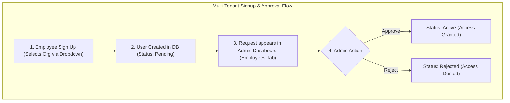

# Enterprise Carpooling Platform - Complete Team Integration & Feature Specification

This specification serves as the unified coordinate system for our **4-member development team**. It aligns both Frontend (React) and Backend (Express/MongoDB) engineers on API contracts, database structures, UI components, states, and screen transitions.

## Source of Truth Rules

Use this file as the contract between frontend, backend, database, and QA.

*   **API base path**: All backend routes start with `/api`.
*   **Auth transport**: Protected REST endpoints use `Authorization: Bearer <JWT_TOKEN>`. The token is returned by login and stored by the frontend.
*   **Coordinates**: Every coordinate array is `[lng, lat]` and uses the field name `coordinates`.
*   **Ride search seats parameter**: Use `seats` everywhere.
*   **Status values**: Frontend labels must match backend enum values exactly unless the UI intentionally maps them for display.
*   **MVP payment scope**: Razorpay Test Mode is used for wallet recharge. Ride fare payment supports `Wallet`, `Cash`, `UPI`, and `Card` as recorded payment methods; only wallet recharge requires Razorpay verification.

---

## 1. System Topology & Authentication Architecture

This platform supports multiple organizations. Each organization has its own employees, vehicle registry, administrators, and cost configuration settings.



### Authentication Logic (Organization Selector)
1. **Dynamic Dropdown**: When the app initializes (Splash/Login/Signup), the frontend fetches the list of partnered organizations from the backend.
2. **Organization Selection**: Users must select their organization from a dropdown menu.
3. **Approval Queue**:
    * **Signup**: Selecting an organization and submitting the registration form registers the account in a `Pending` state. The user *cannot* log in yet.
    * **Admin Notification**: The registration request is sent to that specific organization's admin queue.
    * **Login**: Entering credentials with the correct organization dropdown chosen will only succeed if the admin has marked the user's status as `Active`.

---

## 2. Updated Core Database Schemas

### Organization Collection
Stores partnered enterprises and their administrative parameters.
```javascript
const organizationSchema = new mongoose.Schema({
  name: { type: String, required: true, unique: true }, // e.g. "Odoo Pvt. Ltd."
  domain: { type: String, required: true }, // e.g. "odoo.com"
  industry: { type: String, default: "Software" },
  registeredAddress: { type: String },
  adminContact: { type: String, required: true }, // admin email
  configuration: {
    fuelCostPerLiter: { type: Number, default: 96.50 }, // Rs. per Liter
    costPerKm: { type: Number, default: 8.00 }, // Standard corporate ride fare per km
    operationalTravelCost: { type: Number, default: 2.50 } // Operational markup
  }
});
```

### User Collection
Contains employees, roles, and registration statuses.
```javascript
const userSchema = new mongoose.Schema({
  name: { type: String, required: true },
  email: { type: String, required: true, unique: true },
  password: { type: String, required: true },
  phone: { type: String, required: true },
  department: { type: String },
  manager: { type: String },
  location: { type: String }, // Office/campus/city, e.g. "Gandhinagar"
  role: { type: String, enum: ['Employee', 'Admin'], default: 'Employee' },
  organizationId: { type: mongoose.Schema.Types.ObjectId, ref: 'Organization', required: true },
  status: { type: String, enum: ['Pending', 'Active', 'Revoked', 'Rejected'], default: 'Pending' },
  savedPlaces: {
    home: { address: String, coordinates: { type: [Number], index: '2dsphere' } },
    office: { address: String, coordinates: { type: [Number], index: '2dsphere' } }
  },
  walletBalance: { type: Number, default: 0 }
});
```

### Vehicle Collection
Required before an employee can publish a ride.
```javascript
const vehicleSchema = new mongoose.Schema({
  ownerId: { type: mongoose.Schema.Types.ObjectId, ref: 'User', required: true },
  organizationId: { type: mongoose.Schema.Types.ObjectId, ref: 'Organization', required: true },
  model: { type: String, required: true },
  registrationNumber: { type: String, required: true, unique: true },
  seatingCapacity: { type: Number, required: true }, // Passenger seats, excluding driver
  fuelEfficiency: { type: Number }, // km per liter
  status: { type: String, enum: ['Active', 'Inactive'], default: 'Active' }
});
```

### Ride Collection
```javascript
const rideSchema = new mongoose.Schema({
  organizationId: { type: mongoose.Schema.Types.ObjectId, ref: 'Organization', required: true },
  driverId: { type: mongoose.Schema.Types.ObjectId, ref: 'User', required: true },
  vehicleId: { type: mongoose.Schema.Types.ObjectId, ref: 'Vehicle', required: true },
  pickupLocation: {
    address: { type: String, required: true },
    coordinates: { type: [Number], index: '2dsphere' }
  },
  destinationLocation: {
    address: { type: String, required: true },
    coordinates: { type: [Number], index: '2dsphere' }
  },
  routePolyline: { type: String },
  departureTime: { type: Date, required: true },
  availableSeats: { type: Number, required: true },
  farePerSeat: { type: Number, required: true },
  isRecurring: { type: Boolean, default: false },
  recurringDays: [{ type: String }],
  status: { type: String, enum: ['Scheduled', 'Active', 'Completed', 'Cancelled'], default: 'Scheduled' }
});
```

### Booking Collection
```javascript
const bookingSchema = new mongoose.Schema({
  rideId: { type: mongoose.Schema.Types.ObjectId, ref: 'Ride', required: true },
  passengerId: { type: mongoose.Schema.Types.ObjectId, ref: 'User', required: true },
  seatsBooked: { type: Number, default: 1 },
  pickupPoint: { address: String, coordinates: [Number] },
  dropoffPoint: { address: String, coordinates: [Number] },
  farePaid: { type: Number },
  paymentMethod: { type: String, enum: ['Wallet', 'Cash', 'UPI', 'Card'] },
  status: { type: String, enum: ['Booked', 'Cancelled'], default: 'Booked' }
});
```

### Trip Collection
```javascript
const tripSchema = new mongoose.Schema({
  rideId: { type: mongoose.Schema.Types.ObjectId, ref: 'Ride', required: true },
  driverId: { type: mongoose.Schema.Types.ObjectId, ref: 'User', required: true },
  passengers: [{ type: mongoose.Schema.Types.ObjectId, ref: 'User' }],
  status: {
    type: String,
    enum: ['Ride Booked', 'Trip Started', 'Trip In Progress', 'Trip Completed', 'Payment Pending', 'Payment Completed'],
    default: 'Ride Booked'
  },
  startedAt: { type: Date },
  completedAt: { type: Date },
  telemetry: {
    currentLocation: { type: [Number], index: '2dsphere' },
    etaMinutes: { type: Number },
    distanceTravelled: { type: Number, default: 0 }
  }
});
```

### Transaction Collection
```javascript
const transactionSchema = new mongoose.Schema({
  userId: { type: mongoose.Schema.Types.ObjectId, ref: 'User', required: true },
  bookingId: { type: mongoose.Schema.Types.ObjectId, ref: 'Booking' },
  amount: { type: Number, required: true },
  type: { type: String, enum: ['Recharge', 'Fare Payment', 'Payout'], required: true },
  method: { type: String, enum: ['Wallet', 'Cash', 'UPI', 'Card', 'Razorpay'] },
  status: { type: String, enum: ['Pending', 'Success', 'Failed'], default: 'Pending' },
  razorpayPaymentId: { type: String },
  razorpayOrderId: { type: String },
  createdAt: { type: Date, default: Date.now }
});
```

---

## 3. Screen-by-Screen Specifications & Frontend/Backend Mappings

### Screen 3.1: Splash Screen
*   **Visual Assets (from Sketch/Mockup)**:
    *   Centered car vector icon with 3 passengers.
    *   Tagline: **"Ride Together, Save Together"**.
*   **Behavior**:
    *   Displayed during app bootstrapping (fetching user token from local storage, checking token validity, loading list of organizations).
*   **API Calls**:
    *   **Action**: Page mounts. Fetch list of organizations.
        *   *Endpoint*: `GET /api/organizations`
        *   *Response (200)*:
            ```json
            [
              { "_id": "org_111", "name": "Odoo Pvt. Ltd." },
              { "_id": "org_222", "name": "Google LLC" }
            ]
            ```

---

### Screen 3.2: Login Screen
*   **Visual Assets (from Sketch/Mockup)**:
    *   "Welcome" header widget.
    *   "Email / Mobile" input field.
    *   "Password" input field.
    *   **Organization Dropdown Selector** (populated dynamically from the Splash Screen API fetch).
    *   "Login" action button.
    *   "Create New Account" hyperlink leading to Sign Up.
*   **API Calls**:
    *   **Action**: User clicks "Login".
        *   *Endpoint*: `POST /api/auth/login`
        *   *Payload*:
            ```json
            {
              "email": "khush@odoo.com",
              "password": "Password123",
              "organizationId": "org_111"
            }
            ```
        *   *Response (Success - 200)*:
            ```json
            {
              "token": "JWT_TOKEN_HERE",
              "user": {
                "_id": "user_xyz",
                "name": "Khush Patel",
                "role": "Employee",
                "status": "Active"
              }
            }
            ```
        *   *Response (Pending Admin Approval - 403)*:
            ```json
            { "message": "Your registration request is pending approval from Odoo Pvt. Ltd. Admin." }
            ```
        *   *Response (Blocked/Revoked - 403)*:
            ```json
            { "message": "Your access has been revoked by your Organization Administrator." }
            ```

---

### Screen 3.3: Sign Up Screen
*   **UI Components**:
    *   Full Name, Phone number inputs.
    *   Email input (must match domain validation e.g. `@odoo.com`).
    *   Organization Dropdown.
    *   Password & Confirm Password inputs.
    *   "Register Account" button.
*   **API Calls**:
    *   **Action**: Submit Sign Up form.
        *   *Endpoint*: `POST /api/auth/register`
        *   *Payload*: Same as login payload, adding name, phone, department, manager, and location. Creates user in `Pending` state.
        *   *Response (Success - 201)*:
            ```json
            { "message": "Registration submitted. Waiting for Admin approval." }
            ```

---

### Screen 3.4: Employee Dashboard (Mode Switcher)
*   **UI Components**:
    *   Mode Switch: "Find a Ride" (Passenger) / "Offer a Ride" (Driver).
    *   KPI display: Wallet balance, upcoming booking schedule cards.
    *   Saved Places block: Shortcut buttons for `Home` and `Office`.
*   **API Calls**:
    *   **Action**: Page mounts.
        *   *Endpoint*: `GET /api/users/profile`
    *   **Action**: Fetch upcoming trips.
        *   *Endpoint*: `GET /api/trips/my`
    *   **Action**: Fetch saved places.
        *   *Endpoint*: `GET /api/users/saved-places`

---

### Screen 3.4A: Saved Places
*   **UI Components**:
    *   Saved place list for `Home`, `Office`, and optional custom locations.
    *   Address/map autocomplete and save button.
*   **API Calls**:
    *   **Action**: Fetch saved places.
        *   *Endpoint*: `GET /api/users/saved-places`
    *   **Action**: Create or update saved places.
        *   *Endpoint*: `PUT /api/users/saved-places`
        *   *Payload*:
            ```json
            {
              "home": { "address": "Sector 1, Gandhinagar", "coordinates": [72.6369, 23.2156] },
              "office": { "address": "Odoo Office, Gandhinagar", "coordinates": [72.5276, 23.0351] }
            }
            ```

---

### Screen 3.4B: My Vehicle
*   **UI Components**:
    *   List of vehicles registered by the logged-in employee.
    *   Add/edit vehicle form with model, registration number, seating capacity, and fuel efficiency.
*   **API Calls**:
    *   **Action**: Fetch my vehicles.
        *   *Endpoint*: `GET /api/vehicles`
    *   **Action**: Register a vehicle.
        *   *Endpoint*: `POST /api/vehicles`
        *   *Payload*: `{ "model": "Honda City", "registrationNumber": "GJ01AB1234", "seatingCapacity": 4, "fuelEfficiency": 16 }`
    *   **Action**: Update a vehicle.
        *   *Endpoint*: `PATCH /api/vehicles/:vehicleId`
    *   **Action**: Delete/deactivate a vehicle.
        *   *Endpoint*: `DELETE /api/vehicles/:vehicleId`

---

### Screen 3.4C: My Trips
*   **UI Components**:
    *   Upcoming and active trip cards.
    *   Driver/passenger view of schedule, route, vehicle, seats, fare, and status.
*   **API Calls**:
    *   **Action**: Fetch user's current and upcoming trips.
        *   *Endpoint*: `GET /api/trips/my`
    *   **Action**: Cancel a booking before trip starts.
        *   *Endpoint*: `PATCH /api/bookings/:bookingId/cancel`

---

### Screen 3.4D: Ride History
*   **UI Components**:
    *   Completed/cancelled ride list with route, participants, vehicle, date, fare, and payment status.
*   **API Calls**:
    *   **Action**: Fetch ride history.
        *   *Endpoint*: `GET /api/rides/history`

---

### Screen 3.4E: Reports Dashboard
*   **UI Components**:
    *   Total trips, total distance, fuel consumption, cost per kilometer, vehicle-wise cost, and fuel efficiency trends.
*   **API Calls**:
    *   **Action**: Fetch reports.
        *   *Endpoint*: `GET /api/reports/summary`

---

### Screen 3.5: Find a Ride (Search & Booking)
*   **UI Components**:
    *   Pickup Location, Destination inputs (Map autocomplete).
    *   Date, Time, Seat count fields.
    *   List of available rides nearby (shows: Driver name, Car model, Cost, available Seats).
    *   "Book Now" confirmation button.
*   **API Calls**:
    *   **Action**: User searches.
        *   *Endpoint*: `GET /api/rides/search` (Parameters: `pickupLng`, `pickupLat`, `dropoffLng`, `dropoffLat`, `date`, `seats`)
    *   **Action**: User confirms booking.
        *   *Endpoint*: `POST /api/bookings`
        *   *Payload*: `{ "rideId": "ride_123", "seatsBooked": 2, "pickupPoint": { "address": "...", "coordinates": [...] }, "dropoffPoint": { "address": "...", "coordinates": [...] } }`

---

### Screen 3.6: Offer a Ride (Publishing)
*   **UI Components**:
    *   Vehicle picker (dropdown lists user's cars).
    *   Route Details: Start address, Destination address, Departure date & time.
    *   Available seats counter, Fare pricing input.
    *   "Confirm route & Publish" button.
*   **API Calls**:
    *   **Action**: Fetch user's active vehicles for picker.
        *   *Endpoint*: `GET /api/vehicles`
    *   **Action**: Publish ride.
        *   *Endpoint*: `POST /api/rides/publish`
        *   *Payload*:
            ```json
            {
              "vehicleId": "vehicle_123",
              "pickupLocation": { "address": "Sector 1", "coordinates": [72.6369, 23.2156] },
              "destinationLocation": { "address": "Odoo Office", "coordinates": [72.5276, 23.0351] },
              "departureTime": "2026-07-18T09:00:00.000Z",
              "availableSeats": 3,
              "farePerSeat": 80,
              "isRecurring": false,
              "recurringDays": []
            }
            ```

---

### Screen 3.7: Active Trip & Real-time Location Dashboard
*   **UI Components**:
    *   Lifecycle state displays.
    *   Active tracking map (WebSocket connection).
    *   Native calling trigger: `<a href="tel:+91XXXXXXXXXX">Call Partner</a>`
    *   In-trip instant messaging drawer.
*   **WebSocket Events**:
    *   Emit: `join_trip_room`, `send_location`, `send_chat_message`
    *   Listen: `location_update`, `chat_message_received`, `trip_status_change`

---

### Screen 3.8: Payments & Wallet Screen
*   **UI Components**:
    *   Transaction history table.
    *   Razorpay mock recharge container (INR amount entry).
*   **API Calls**:
    *   Fetch Transactions: `GET /api/wallet/transactions`
    *   Generate Order: `POST /api/wallet/recharge`
    *   Verify & Credit: `POST /api/wallet/verify-recharge`
    *   Pay Ride Fare: `POST /api/payments/ride-fare`
        *   *Payload*: `{ "bookingId": "booking_123", "method": "Wallet" }`

---

### Screen 3.9: Admin Dashboard - Employees Tab
*   **Visual Assets (from Sketch/Mockup)**:
    *   Summary Widget Cards: Total Employees (48), Registered Vehicles (22), Rides This Month (163).
    *   **Employees List Table**:
        *   Headers: `Name`, `Email`, `Department`, `Manager`, `Location`, `Platform Access`.
        *   `Platform Access` column contains status badges: `Pending`, `Active`, `Revoked`.
    *   **"+ Add Employee"** action button: Launches modal to add/pre-approve employees directly.
*   **API Calls**:
    *   **Action**: Page Mounts. Fetch all employees in organization.
        *   *Endpoint*: `GET /api/admin/employees`
        *   *Response (200)*:
            ```json
            [
              { "_id": "u_88", "name": "Parth Kavad", "email": "parth@odoo.com", "department": "R&D", "manager": "A. Shah", "location": "Gandhinagar", "status": "Pending" }
            ]
            ```
    *   **Action**: Admin approves/revokes access.
        *   *Endpoint*: `PATCH /api/admin/employees/:userId/access`
        *   *Payload*: `{ "status": "Active" }` (or `"Revoked"`)
        *   *Response (200)*: `{ "message": "Employee access status updated." }`
    *   **Action**: Submit Add Employee form.
        *   *Endpoint*: `POST /api/admin/employees`
        *   *Payload*: `{ "name": "John Doe", "email": "john@odoo.com", "department": "HR", "manager": "Jane", "location": "Gandhinagar" }`

---

### Screen 3.10: Admin Dashboard - Vehicles Tab
*   **Visual Assets (from Sketch/Mockup)**:
    *   Same KPI Summary Cards.
    *   **Vehicles List Table**:
        *   Headers: `Registration Number`, `Model`, `Seating Capacity`, `Driver`, `Status`.
        *   `Status` values: `Active` / `Inactive`.
    *   **"+ Add Vehicle"** action button: Modal to register vehicle records on behalf of employees.
*   **API Calls**:
    *   **Action**: Fetch all vehicles in organization.
        *   *Endpoint*: `GET /api/admin/vehicles`
    *   **Action**: Toggle vehicle status.
        *   *Endpoint*: `PATCH /api/admin/vehicles/:vehicleId/status`
        *   *Payload*: `{ "status": "Inactive" }`
    *   **Action**: Add vehicle for an employee.
        *   *Endpoint*: `POST /api/admin/vehicles`
        *   *Payload*: `{ "ownerId": "user_123", "model": "Honda City", "registrationNumber": "GJ01AB1234", "seatingCapacity": 4, "fuelEfficiency": 16 }`

---

### Screen 3.11: Admin Dashboard - Settings Tab
*   **Visual Assets (from Sketch/Mockup)**:
    *   Same KPI Summary Cards.
    *   **"Company Details" Form**:
        *   Company Name: `Odoo Pvt. Ltd.` (input)
        *   Industry: `Software` (input)
        *   Registered Address: `Gandhinagar` (input)
        *   Admin Contact: `admin@odoo.com` (input)
        *   Registered Employees counts (read-only)
    *   **"Carpooling Configuration" Form**:
        *   Fuel Cost / Liter: `Rs. 96.50` (input)
        *   Cost Per KM: `Rs. 8.00` (input)
        *   Travel Cost (Operational): `Rs. 2.50 / Km` (input)
    *   **"Save Settings"** confirmation button.
*   **API Calls**:
    *   **Action**: Page Mounts. Fetch organization configurations.
        *   *Endpoint*: `GET /api/admin/settings`
    *   **Action**: Save Settings.
        *   *Endpoint*: `PUT /api/admin/settings`
        *   *Payload*:
            ```json
            {
              "name": "Odoo Pvt. Ltd.",
              "industry": "Software",
              "registeredAddress": "Gandhinagar",
              "adminContact": "admin@odoo.com",
              "fuelCostPerLiter": 96.50,
              "costPerKm": 8.00,
              "operationalTravelCost": 2.50
            }
            ```
            
---

## 4. Master API Endpoint Matrix

All REST API requests require standard HTTP headers:
*   `Content-Type: application/json`
*   `Authorization: Bearer <JWT_TOKEN>` (for protected endpoints)

| Route Endpoint | Method | Auth Required | Description |
| :--- | :--- | :--- | :--- |
| **GET** `/api/organizations` | `GET` | No | Fetch list of organizations for dropdown |
| **POST** `/api/auth/register` | `POST` | No | Create user record in `Pending` state |
| **POST** `/api/auth/login` | `POST` | No | Verify credentials, check status, return token |
| **GET** `/api/users/profile` | `GET` | Yes | Get logged-in employee statistics |
| **GET** `/api/users/saved-places` | `GET` | Yes | Get home/office/custom saved places |
| **PUT** `/api/users/saved-places` | `PUT` | Yes | Create or update saved places |
| **GET** `/api/vehicles` | `GET` | Yes | List logged-in user's vehicles |
| **POST** `/api/vehicles` | `POST` | Yes | Register logged-in user's vehicle |
| **PATCH** `/api/vehicles/:id` | `PATCH` | Yes | Update logged-in user's vehicle |
| **DELETE** `/api/vehicles/:id` | `DELETE` | Yes | Deactivate/delete logged-in user's vehicle |
| **GET** `/api/rides/search` | `GET` | Yes | Query matching rides using radial math |
| **POST** `/api/rides/publish` | `POST` | Yes | Publish a ride offer (requires active vehicle) |
| **GET** `/api/rides/history` | `GET` | Yes | Get completed and cancelled ride history |
| **POST** `/api/bookings` | `POST` | Yes | Book seats on a matched ride |
| **PATCH** `/api/bookings/:id/cancel` | `PATCH` | Yes | Cancel a booking before trip starts |
| **GET** `/api/trips/my` | `GET` | Yes | Get logged-in user's active and upcoming trips |
| **PATCH** `/api/trips/:tripId/status` | `PATCH` | Yes | Update trip status (Booked -> Started -> Completed) |
| **GET** `/api/wallet/transactions` | `GET` | Yes | Get wallet and fare transaction history |
| **POST** `/api/wallet/recharge` | `POST` | Yes | Create Razorpay order |
| **POST** `/api/wallet/verify-recharge` | `POST` | Yes | Verify cryptographic signatures & credit wallet |
| **POST** `/api/payments/ride-fare` | `POST` | Yes | Record or process ride fare payment |
| **GET** `/api/reports/summary` | `GET` | Yes | Get trip, distance, fuel, and cost analytics |
| **GET** `/api/admin/employees` | `GET` | Admin Only | Get all employees for approval/access queue |
| **PATCH** `/api/admin/employees/:id/access`| `PATCH` | Admin Only | Approve (`Active`) or revoke (`Revoked`) access |
| **GET** `/api/admin/vehicles` | `GET` | Admin Only | List all organization vehicles |
| **POST** `/api/admin/vehicles` | `POST` | Admin Only | Register a vehicle for an employee |
| **PATCH** `/api/admin/vehicles/:id/status` | `PATCH` | Admin Only | Toggle vehicle activation status |
| **GET** `/api/admin/settings` | `GET` | Admin Only | Get organization details and configuration values |
| **PUT** `/api/admin/settings` | `PUT` | Admin Only | Save customized settings & cost configurations |

---

## 5. Live Tracking WebSocket & Redis Contract Specification

To achieve real-time, low-latency live tracking without overloading MongoDB, the system relies on an event-driven WebSocket pipeline (Socket.io) backed by Redis caching.

### 5.1 Redis Key Registry

| Redis Key | Data Type | Redis Commands Used | Description / Payload Structure |
| :--- | :--- | :--- | :--- |
| `trip:telemetry:${tripId}` | Hash | `HSET`, `HGETALL`, `EXPIRE` | Stores latest GPS telemetry for a trip. <br>Fields: `lng`, `lat`, `bearing`, `speed`, `etaMinutes`, `updatedAt` |
| `active_trips` | GeoSet | `GEOADD`, `GEOPOS`, `ZREM` | Geo-index of active driver coordinates. <br>Format: `GEOADD active_trips <lng> <lat> <tripId>` |

*   **Cache Time-To-Live (TTL)**: For active telemetry hashes, set `EXPIRE trip:telemetry:${tripId} 86400` (24-hour expiration) to ensure old location data is automatically garbage collected.

---

### 5.2 Socket.io Event Registry (JSON Schemas)

Every WebSocket payload exchanged between client and server must conform strictly to these models:

#### Event 1: `join_trip_room` (Client $\rightarrow$ Server)
*   **Trigger**: Sent by both passenger and driver when mounting the active tracking screen.
*   **Payload**:
    ```json
    {
      "tripId": "trip_555",
      "userId": "user_xyz",
      "role": "Passenger" 
    }
    ```
*   **Server Response (`room_joined`)**: Emitted back to the joining socket:
    ```json
    {
      "status": "success",
      "message": "Joined room trip:trip_555",
      "initialState": {
        "status": "Trip In Progress",
        "lastTelemetry": {
          "coordinates": [72.5276, 23.0351],
          "bearing": 180,
          "etaMinutes": 12,
          "updatedAt": "2026-07-18T12:00:00.000Z"
        }
      }
    }
    ```

#### Event 2: `send_location` (Driver Client $\rightarrow$ Server)
*   **Trigger**: Emitted by the driver's client device every 3 seconds while trip status is `Trip Started` or `Trip In Progress`.
*   **Payload**:
    ```json
    {
      "tripId": "trip_555",
      "coordinates": [72.5276, 23.0351],
      "bearing": 185.5,
      "speed": 40.5,
      "etaMinutes": 10
    }
    ```
*   **Server Processing**:
    1. Parse coordinates: `lng = 72.5276`, `lat = 23.0351`.
    2. Write to Redis Hash: `HSET trip:telemetry:trip_555 lng 72.5276 lat 23.0351 bearing 185.5 etaMinutes 10 updatedAt <ISO_TIME>`.
    3. Update GeoSet: `GEOADD active_trips 72.5276 23.0351 trip_555`.
    4. Broadcast `location_update` to the room `trip:trip_555`.

#### Event 3: `location_update` (Server $\rightarrow$ Passenger Client)
*   **Trigger**: Broadcasted by the server to all passengers joined in `trip:trip_555`.
*   **Payload**:
    ```json
    {
      "tripId": "trip_555",
      "coordinates": [72.5276, 23.0351],
      "bearing": 185.5,
      "etaMinutes": 10,
      "updatedAt": "2026-07-18T12:35:03.123Z"
    }
    ```

#### Event 4: `send_chat_message` (Client $\rightarrow$ Server)
*   **Trigger**: Sent when a user submits a text message in the chat drawer.
*   **Payload**:
    ```json
    {
      "tripId": "trip_555",
      "senderId": "user_xyz",
      "senderName": "Khush Patel",
      "message": "I'm standing near the blue sign board."
    }
    ```
*   **Server Processing**:
    1. Save message to MongoDB `chats` collection asynchronously.
    2. Broadcast `chat_message_received` to the room `trip:trip_555`.

#### Event 5: `chat_message_received` (Server $\rightarrow$ Clients)
*   **Trigger**: Broadcasted to all users in the trip's room.
*   **Payload**:
    ```json
    {
      "_id": "msg_abc999",
      "tripId": "trip_555",
      "senderId": "user_xyz",
      "senderName": "Khush Patel",
      "message": "I'm standing near the blue sign board.",
      "createdAt": "2026-07-18T12:35:10.500Z"
    }
    ```

#### Event 6: `trip_status_change` (Server $\rightarrow$ Clients)
*   **Trigger**: Emitted when a driver starts or completes the trip.
*   **Payload**:
    ```json
    {
      "tripId": "trip_555",
      "status": "Trip Completed"
    }
    ```
*   **Server Processing (Upon Trip Completion)**:
    1. Retrieve final telemetry from Redis.
    2. Write final distance metrics to MongoDB.
    3. Clear Redis keys: `DEL trip:telemetry:trip_555` and `ZREM active_trips trip_555`.
    4. Emit status change to passengers to transition their UI states.
